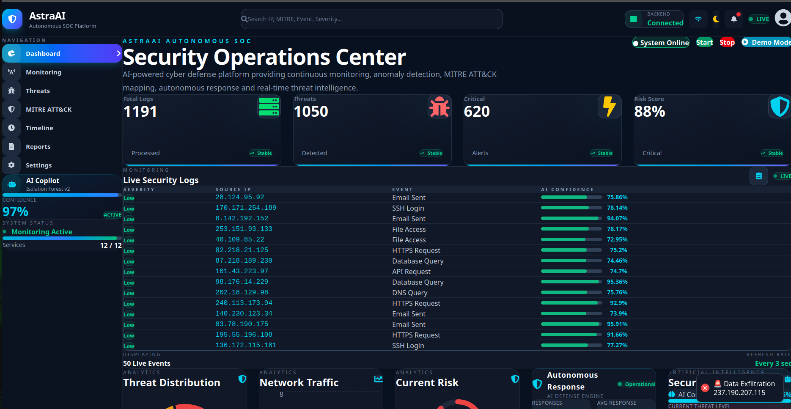
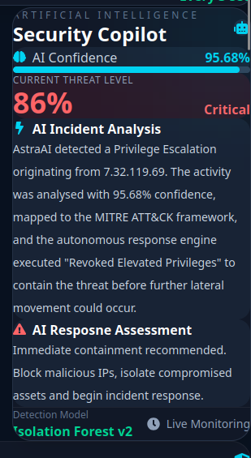
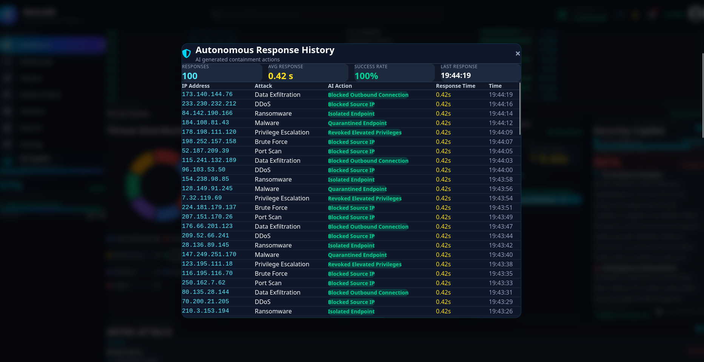
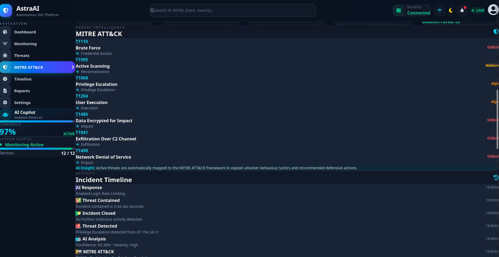
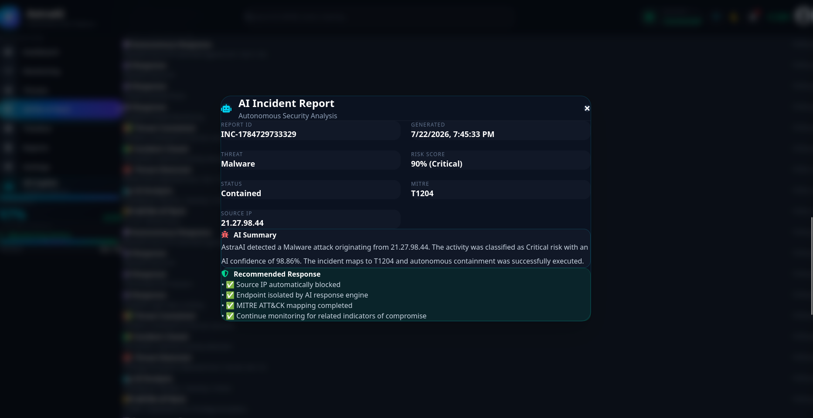

<div align="center">



# 🛡️ AstraAI

### AI-Powered Autonomous Security Operations Center (SOC)

**Enhancing Cyber Resilience for Critical National Infrastructure**


</div>

---

# 📖 Overview

AstraAI is an AI-powered Autonomous Security Operations Center (SOC) prototype developed to improve the cyber resilience of Critical National Infrastructure (CNI).

The platform continuously monitors network activity, detects suspicious behaviour using machine learning, classifies attacks, maps them to the MITRE ATT&CK framework, assesses risk, performs simulated autonomous response actions, and presents all security events through a modern real-time SOC dashboard.

Unlike traditional monitoring dashboards that primarily generate alerts, AstraAI demonstrates how AI can support security analysts throughout the complete incident lifecycle, from anomaly detection and threat classification to autonomous response, reporting, and visualization.

---

## 📑 Table of Contents

- [Overview](#-overview)
- [Key Features](#-key-features)
- [Supported Attack Types](#-supported-attack-types)
- [System Architecture](#-system-architecture)
- [AI Workflow](#-ai-workflow)
- [Dashboard Modules](#-dashboard-modules)
- [Technology Stack](#-technology-stack)
- [Project Structure](#-project-structure)
- [Installation](#-installation)
- [Screenshots](#-screenshots)
- [Example Incident Flow](#-example-incident-flow)
- [Future Enhancements](#-future-enhancements)
- [Hackathon Submission](#-hackathon-submission)
- [Team](#-team)

---

# ✨ Key Features

### 🤖 AI Threat Detection

- Isolation Forest based anomaly detection
- AI confidence scoring
- Intelligent threat classification
- Real-time security monitoring

### 🛡️ Autonomous Response

- Autonomous IP blocking simulation
- Endpoint isolation simulation
- Automated containment actions
- Response history tracking
- Response time monitoring

### 📊 SOC Dashboard

- Live network traffic visualization
- Threat distribution analytics
- Dynamic cyber risk gauge
- Interactive security dashboard
- Live threat notifications

### 🗺️ MITRE ATT&CK Integration

- Automatic ATT&CK technique mapping
- MITRE IDs
- Technique descriptions
- Security context for detected attacks

### 🧠 AI Security Copilot

- AI-generated incident summaries
- Threat explanations
- Recommended security actions
- Incident insights

### 📜 Incident Reporting

- Executive incident reports
- Incident timeline
- Threat history
- Response tracking

---

# 🎯 Supported Attack Types

- Port Scan
- Brute Force
- Malware
- Ransomware
- DDoS
- Privilege Escalation
- Data Exfiltration
- Unknown AI Anomalies

---

# 🏗️ System Architecture

```text
                +----------------------+
                | Traffic Simulator    |
                +----------+-----------+
                           |
                           v
                 +----------------------+
                 | AI Detection Engine  |
                 +----------+-----------+
                           |
          +----------------+----------------+
          |                                 |
          v                                 v
   MITRE ATT&CK Mapper             Risk Assessment
          |                                 |
          +----------------+----------------+
                           |
                           v
              Autonomous Response Engine
                           |
                           v
                  Executive Reporting
                           |
                           v
                Real-Time SOC Dashboard
```

---

# ⚙️ AI Workflow

```text
Network Traffic
        │
        ▼
AI Anomaly Detection
        │
        ▼
Threat Classification
        │
        ▼
MITRE ATT&CK Mapping
        │
        ▼
Risk Assessment
        │
        ▼
AI Explanation
        │
        ▼
Autonomous Response
        │
        ▼
Dashboard & Incident Report
```

---

# 🖥️ Dashboard Modules

- Live Monitoring
- Network Traffic Analytics
- Threat Distribution
- Dynamic Risk Assessment
- AI Security Copilot
- MITRE ATT&CK Mapping
- Autonomous Response
- Incident Timeline
- Executive Reports

---

# 🛠️ Technology Stack

## Frontend

- React
- Vite
- Tailwind CSS
- Framer Motion
- React Icons
- Chart.js

## Backend

- FastAPI
- Python
- SQLite
- SQLAlchemy

## Artificial Intelligence

- Scikit-learn
- Isolation Forest
- Rule-based Threat Classification
- Dynamic Risk Assessment

---

# 📂 Project Structure

```text
AstraAI
│
├── astraai-backend
│   ├── ai
│   ├── api
│   ├── database
│   ├── simulator
│   ├── response_engine.py
│   ├── monitor.py
│   └── main.py
│
├── astraai-frontend
│   ├── src
│   │   ├── components
│   │   ├── charts
│   │   ├── pages
│   │   ├── modals
│   │   ├── services
│   │   └── App.jsx
│
├── screenshots
│
└── README.md
```

---

# 🚀 Installation

## Clone the Repository

```bash
git clone https://github.com/childishnoob/AstraAI.git
```

## Backend

```bash
cd astraai-backend

pip install -r requirements.txt

uvicorn main:app --reload
```

## Frontend

```bash
cd astraai-frontend

npm install

npm run dev
```

After starting both services:

**Frontend**
```text
http://localhost:5173
```

**Backend API**
```text
http://localhost:8000
```

**API Documentation (Swagger UI)**
```text
http://localhost:8000/docs
```

---

# ✅ Core Capabilities

| Feature | Status |
|---------|:------:|
| AI Threat Detection | ✅ |
| Isolation Forest | ✅ |
| MITRE ATT&CK Mapping | ✅ |
| Autonomous Response | ✅ |
| AI Copilot | ✅ |
| Incident Timeline | ✅ |
| Executive Reports | ✅ |
| Risk Assessment | ✅ |
| Live Dashboard | ✅ |

---

# 📸 Screenshots

## 🖥️ AstraAI Dashboard

Real-time Autonomous Security Operations Center (SOC) dashboard featuring live security monitoring, AI-powered threat detection, risk analytics, network traffic visualization, autonomous response engine, and the AI Security Copilot.

<p align="center">
  
</p>

---

## 🤖 AI Security Copilot

The AI Security Copilot automatically analyzes detected incidents, explains attack behavior, estimates confidence scores, and recommends containment actions using AI-driven reasoning.

<p align="center">
  
</p>

---

## 🛡️ Autonomous Response Engine

AstraAI autonomously responds to detected threats by blocking malicious IPs, isolating compromised endpoints, revoking elevated privileges, and maintaining a complete response history with execution time and success metrics.

<p align="center">
  
</p>

---

## 🎯 MITRE ATT&CK Mapping & Incident Timeline

Every detected threat is automatically mapped to the MITRE ATT&CK framework while simultaneously generating a complete incident timeline covering detection, AI analysis, response execution, containment, and closure.

<p align="center">
  
</p>

---

## 📄 AI Incident Report

AstraAI automatically generates comprehensive incident reports containing threat classification, AI-generated analysis, MITRE ATT&CK mapping, risk score, executed response actions, and recommended security measures.

<p align="center">
  
</p>

---

# 📈 Example Incident Flow

```text
┌───────────────────────┐
│  Network Traffic      │
└──────────┬────────────┘
           │
           ▼
┌───────────────────────┐
│ AI Threat Detection   │
└──────────┬────────────┘
           │
           ▼
┌───────────────────────┐
│ MITRE ATT&CK Mapping  │
└──────────┬────────────┘
           │
           ▼
┌───────────────────────┐
│ Autonomous Response   │
└──────────┬────────────┘
           │
           ▼
┌───────────────────────┐
│ SOC Dashboard         │
└───────────────────────┘
```

---

# 🔮 Future Enhancements

- SIEM Integration
- Threat Intelligence Feeds
- Email Notifications
- Live Packet Capture
- Cloud Deployment
- PDF Report Export
- Multi-user Authentication
- Role-Based Access Control
- LLM-assisted Threat Investigation

---

# 🏆 ET AI Hackathon 2.0 Submission

AstraAI was developed as a prototype for the **ET AI Hackathon 2.0** to demonstrate how Artificial Intelligence can enhance modern Security Operations Centers by combining:

- AI-powered anomaly detection
- Real-time threat monitoring
- MITRE ATT&CK mapping
- Dynamic risk assessment
- Autonomous incident response
- Intelligent incident reporting

---

# 🙏 Acknowledgements

- MITRE ATT&CK Framework
- FastAPI
- React
- Scikit-learn
- Open Source Community

---

# 👥 Team

| Name | Role |
|------|------|
| Harshita Gupta | AI & Full Stack Development |
| Ansh Sharma | AI & Full Stack Development |


---

# 📄 License

This project was developed for educational and hackathon purposes.

---

<div align="center">

⭐ If you found AstraAI interesting, consider giving this repository a star.

Built with ❤️ for ET AI Hackathon 2.0

</div>